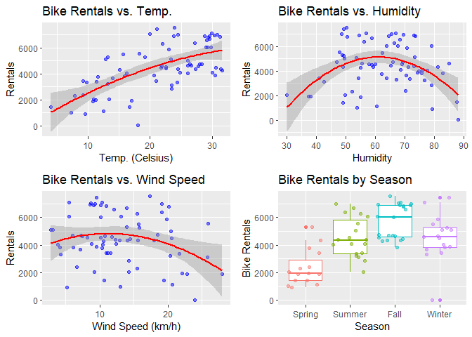

Monday Analysis
================
John Clements and Jingjing Li
7/1/2021

-   [Introduction](#introduction)
-   [Reading in and Subsetting the
    Data](#reading-in-and-subsetting-the-data)
-   [Data Exploration](#data-exploration)
-   [Modeling](#modeling)
    -   [Linear Models](#linear-models)
        -   [Linear Model 1 (OLS)](#linear-model-1-ols)
        -   [Linear Model 2 (Poisson
            Regression)](#linear-model-2-poisson-regression)
    -   [Tree-based Ensemble Models](#tree-based-ensemble-models)
        -   [Random Forest](#random-forest)
        -   [Boosted Trees](#boosted-trees)
    -   [Comparing the Models](#comparing-the-models)

# Introduction

This project aims at analyzing and creating predictive models on “Bike
Sharing Dataset” at [“UCI Machine Learning
Repository”](https://archive.ics.uci.edu/ml/datasets/Bike+Sharing+Dataset#)
Where core data set is related to two-year log (2011, 2012) from Capital
Bikeshare system, Washington D.C. The data set mainly contains
information about the weather on a given day, when the day was (date,
season, month, and year), and whether the day was a holiday or working
day as well as bike rental counts including casual, registered riders
and total number of bike rentals (`cnt`).

In our study the total number of rentals on a given weekday (here
Monday) will act as the response, which makes more sense for bike rental
business compared to only the casual or the registered . Explanatory
variables comprise the weather variables, the season, and the year. The
weather related variables are `temp` (normalized temperature), `hum`
(normalized humidity), `windspeed` (normalized wind speed), and
`weathersit`. The variable `weathersit` is a factor going from 1 to 4,
with 1 being nice weather and progressing to 4, which covers severe
weather conditions. The `season` variable is a factor for the four
seasons, and `yr` is the year.

We analyze the data using plots and tables to see the distribution of
bike rentals, the weather situation of different seasons and construct
different models (two linear and two tree models) to predict bike rental
numbers affected by `season`, `yr` and weather situations represented by
`temp`,`hum` and`windspeed`, compare those models and identify the best
one.

The main steps includes:

-   load in the required packages
-   read in the data and subset for Mondays and split into training and
    testings sets
-   do exploratory analysis through summary statistics and data
    visualization
-   evaluate models in repeated k-folds cross-validation (CV)
-   evaluate the models on the withheld testing data

Now let’s get started by reading in loading the required packages.

``` r
library(readr)
library(tidyverse)
library(cowplot)
library(caret)
library(rmarkdown)
```

# Reading in and Subsetting the Data

Before doing any analysis, we need to read in the daily bike-share data
and subset for all the Mondays in the data set.

``` r
# Read in the daily data set.
bikeDay <- read_csv("./Bike-Sharing-Dataset/day.csv")
bikeDay <- filter(bikeDay, weekday == params$weekday)
```

Some of the variables, namely, `season`, `mnth`, `holiday`,
`workingday`, and `weathersit` are categorical, but are stored
numerically. Before proceeding with the analysis, we are converting them
to `factor` data types.

``` r
# Convert categorical variables stored numerically to factors.
bikeDay <- bikeDay %>%
  mutate(season = factor(ifelse(season == 1, "Spring",     
                                ifelse(season == 2, "Summer", 
                                       ifelse(season == 3, "Fall",
                                              "Winter"))),
                         levels=c("Spring", "Summer", "Fall", "Winter")),
         mnth = factor(mnth, levels=1:12),
         holiday = factor(holiday, levels=c(0, 1)),
         workingday = factor(workingday, levels=c(0, 1)),
         weathersit = ordered(weathersit, levels=c(1, 2, 3, 4))
         )
```

With that done, we can split the two data sets into training and testing
sets for predictive modeling.

``` r
# Set a random seed for reproducibility.
set.seed(10)

# Set the proportion of observations to use for training models.
trainProp <- 0.7

# Get indexes for the training and testing subsets of the daily data.
trainIndexes <- sample(1:nrow(bikeDay),
                          size=nrow(bikeDay)*trainProp)
testIndexes <- setdiff(1:nrow(bikeDay), trainIndexes)
# Use the indexes to separate the training and testing sets of the daily data.
bikeTrain <- bikeDay[trainIndexes, ]
bikeTest <- bikeDay[testIndexes, ]
```

With our data sets created, we can now begin exploring the data.

# Data Exploration

Let’s begin our exploration with a histogram of the number of bike
rentals in a day for all the Mondays in the data to get an idea of the
distribution.

``` r
# Create a histogram of bike rentals in a day.
plot1 <- ggplot(bikeTrain, aes(x=cnt)) + 
  geom_histogram(bins=25, color="blue", fill="lightblue") + 
  xlab("Bike Rentals") + 
  ylab("Counts") + 
  ggtitle("Histogram of Bike Rentals")

plot1
```

<!-- -->

Next, let’s examine the numeric variables related to weather:
temperature, humidity, and wind speed. Below are the means and standard
deviations for each of these variables by season. This is one way of
measuring the central tendency and spread of the distributions.

``` r
# Find the means and standard deviations of temperature, humidity and windspeed by season.
# Note that normalized data are converted back into original data using following formulas.
seasonalSummary <- bikeTrain %>% 
  group_by(season) %>% 
  summarise(
    avgtemp = mean(temp*41), sdtemp = sd(temp*41), 
    avghum = mean(hum*100), sdhum = sd(hum*100), 
    avgwindspd = mean(windspeed*67), sdwindspd=sd(windspeed*67)
    )

# Print out the table.
knitr::kable(
  seasonalSummary,
  col.names=c("Season", 
              "Temp. Mean", "Temp. Std. Dev.",
              "Humidity Mean", "Humidity Std. Dev.",
              "Wind Speed Mean", "Wind Speed Std. Dev."),
  digits=2,
  caption=paste0("Table 1: Means and Standard Deviations for Daily Temp. ",
                 "(Celsius), Humidity, and Wind Speed (km/h)")
)
```

| Season | Temp. Mean | Temp. Std. Dev. | Humidity Mean | Humidity Std. Dev. | Wind Speed Mean | Wind Speed Std. Dev. |
|:-------|-----------:|----------------:|--------------:|-------------------:|----------------:|---------------------:|
| Spring |      11.60 |            4.11 |         55.63 |              14.34 |           15.10 |                 6.56 |
| Summer |      23.64 |            5.08 |         62.33 |              14.16 |           15.90 |                 5.28 |
| Fall   |      28.58 |            2.58 |         64.19 |               8.80 |           11.04 |                 3.91 |
| Winter |      17.94 |            4.82 |         67.01 |              11.97 |           10.39 |                 6.68 |

Table 1: Means and Standard Deviations for Daily Temp. (Celsius),
Humidity, and Wind Speed (km/h)

The box plots below gives a better sense of the distributions of these
variables by season, than just the two summary statistics.

``` r
###
# Create boxplots of the variables mentioned above, grouped by season.
###

plot2 <- ggplot(bikeTrain, aes(x=season, y=temp*41, color=season)) + 
  geom_boxplot() +
  geom_jitter(alpha=0.5) +
  labs(x="Season",
       y="Temp. (Celsius)",
       title="Box Plot of Temp. by Season") + 
  theme(legend.position="none")

plot3 <- ggplot(bikeTrain, aes(x=season, y=hum*100, color=season)) + 
  geom_boxplot() +
  geom_jitter(alpha=0.5) +
  labs(x="Season",
       y="Humidity",
       title="Box Plot of Humidity by Season") + 
  theme(legend.position="none")

plot4 <- ggplot(bikeTrain, aes(x=season, y=windspeed*67, 
                                        color=season)) + 
  geom_boxplot() +
  geom_jitter(alpha=0.5) +
  labs(x="Season",
       y="Wind Speed (km/h)",
       title="Box Plot of Wind Speed by Season") + 
  theme(legend.position="none")

plot_grid(plot2, plot3, plot4)
```

<!-- -->

Now let’s examine the counts of weather situation by season to see if
some seasons tend to have better or worse weather compared to the
others.

``` r
# Compare weather situation counts for the four seasons.
seasonWeather <- table(bikeTrain$season, bikeTrain$weathersit)

# Display the table.
knitr::kable(
  seasonWeather,
  col.names=c("Pleasant", "Overcast", "Unpleasant", "Severe"),
  caption="Table 2: Weather Situation by Season"
)
```

|        | Pleasant | Overcast | Unpleasant | Severe |
|:-------|---------:|---------:|-----------:|-------:|
| Spring |       10 |        5 |          0 |      0 |
| Summer |       11 |        8 |          0 |      0 |
| Fall   |       16 |        6 |          0 |      0 |
| Winter |       12 |        4 |          1 |      0 |

Table 2: Weather Situation by Season

Although the relationships between seasons and numeric weather measures
are interesting, we want to predict bike rentals. So now we look at how
our weather variables and seasons relate to bike rentals.

We start with the mean and standard deviation of the total daily bike
rentals in each season to look for seasonal differences in the number
and variability of daily bike rentals.

``` r
# Find the means and standard deviations of temperature, humidity and windspeed by season.
# Note that normalized data are converted back into original data using following formulas.
seasonalSummaryCnt <- bikeTrain %>% 
  group_by(season) %>% 
  summarise(
    avgCnt = mean(cnt), sdtemp = sd(cnt)
    )

# Print out the table.
knitr::kable(
  seasonalSummaryCnt,
  col.names=c("Season", 
              "Daily Rentals Mean", "Daily Rentals Std. Dev."),
  digits=2,
  caption=paste0("Table 2: Means and Standard Deviations Daily Rides by ",
                 "season")
)
```

| Season | Daily Rentals Mean | Daily Rentals Std. Dev. |
|:-------|-------------------:|------------------------:|
| Spring |            2344.73 |                 1297.28 |
| Summer |            4546.95 |                 1430.05 |
| Fall   |            5732.41 |                 1242.35 |
| Winter |            4537.29 |                 1654.65 |

Table 2: Means and Standard Deviations Daily Rides by season

Next we look at scatter plots of total daily rentals vs. the numeric
weather measures with quadratic regression lines over-layed.
Additionally, we create box plots by season to visually inspect the
differences in bike rentals by season.

``` r
###
# Create scatter plots for bike rentals vs. our numeric variables and box plots
# for bike rentals by season.
###

plot5 <- ggplot(bikeTrain, aes(x=temp*41, y=cnt)) + 
  geom_point(color="blue", alpha=0.5) + 
  geom_smooth(method = 'lm', formula='y ~ poly(x, 2)', color="red") +
  xlab("Temp. (Celsius)") + 
  ylab("Rentals") + 
  ggtitle("Bike Rentals vs. Temp.")

plot6 <- ggplot(bikeTrain, aes(x=hum*100, y=cnt)) + 
  geom_point(color="blue", alpha=0.5) + 
  geom_smooth(method = 'lm', formula='y ~ poly(x, 2)', color="red") +
  xlab("Humidity") + 
  ylab("Rentals") + 
  ggtitle("Bike Rentals vs. Humidity")

plot7<- ggplot(bikeTrain, aes(x=windspeed*67, y=cnt)) + 
  geom_point(color="blue", alpha=0.5) + 
  geom_smooth(method = 'lm', formula='y ~ poly(x, 2)', color="red") +
  xlab("Wind Speed (km/h)") + 
  ylab("Rentals") + 
  ggtitle("Bike Rentals vs. Wind Speed")

plot8 <- ggplot(bikeTrain, aes(x=season, y=cnt, color=season)) + 
  geom_boxplot() + 
  geom_jitter(alpha=0.5) + 
  xlab("Season") + 
  ylab("Bike Rentals") + 
  ggtitle("Bike Rentals by Season") +
  theme(legend.position="none")

plot_grid(plot5, plot6, plot7, plot8)
```

<!-- -->

Finally, we examine the distributions of bike rentals by weather
situation and year. We can tell if the distribution of bike rentals
varies by weather conditions or by year.

``` r
###
# Create box plots of bike rentals by weather situation and year.
###

plot9 <- ggplot(bikeTrain, aes(x=weathersit, y=cnt, 
                                        color=weathersit)) + 
  geom_boxplot() + 
  geom_jitter(alpha=0.5) + 
  xlab("Weather Situation") + 
  ylab("Bike Rentals") + 
  ggtitle("Bike Rentals by Weather") +
  theme(legend.position="none")

plot10 <- ggplot(bikeTrain, aes(as.factor(yr+2011), cnt,
                                color=as.factor(yr+2011))) + 
  geom_boxplot() + 
  geom_jitter(alpha=0.5) +
  xlab("Year") + 
  ylab("Bike Rentals") + 
  ggtitle("Bike Rentals by Year") +
  theme(legend.position="none")

plot_grid(plot9, plot10)
```

<!-- -->

We now have an idea of how our predictive features relate to the number
of bike rentals, so we are ready to move onto modeling.

# Modeling

We want to predict bike rental demand in a given day conditional on
weather-related variables, the season, and the year. These can be known
*a priori* (assuming a weather forecast for the next day is very
accurate). We will try linear and ensemble modeling approaches.

``` r
# Set the parameters for repeated k-folds CV.
k <- 5
repeats <- 3

# Create a trainControl object for repeated k-folds CV.
trCntrl <- trainControl(method="repeatedcv", number=k, repeats=repeats)
```

We are doing 5-folds CV with 3 repeats.

## Linear Models

Linear regression models a dependent variable as a function of a set of
independent variables that is linear in its parameters. The most
widely-known linear regression technique is ordinary least squares
([OLS](https://en.wikipedia.org/wiki/Ordinary_least_squares)), which
assumes normally distributed errors. **OLS** is a special case of the
generalized linear model
([GLM](https://en.wikipedia.org/wiki/Generalized_linear_model)), which
allows for the errors to follow non-normal distributions. We will try
both an **OLS** model and a **GLM**, with the same variables and
transformations.

### Linear Model 1 (OLS)

For our first model, we are assuming the number of bike rentals has
quadratic relationships with temperature, wind speed, and humidity, with
seasonal effects, and a linear trend for year. The linear trend of year
will probably perform particularly poorly for extrapolation. As the bike
rental company is around longer, their rate of yearly growth will
decrease as they approach market saturation. The model is shown below.

\# of rentals<sub>*i*</sub> = *β*<sub>0</sub> + *β*<sub>1</sub>temp<sub>*i*</sub> + *β*<sub>2</sub>temp<sub>*i*</sub><sup>2</sup> + *β*<sub>3</sub>wind speed<sub>*i*</sub> + *β*<sub>4</sub>wind speed<sub>*i*</sub><sup>2</sup> + *β*<sub>5</sub>humidity<sub>*i*</sub> + *β*<sub>6</sub>humidity<sub>*i*</sub><sup>2</sup> + *β*<sub>7</sub>Summer<sub>*i*</sub> + *β*<sub>8</sub>Fall<sub>*i*</sub> + *β*<sub>9</sub>Winter<sub>*i*</sub> + *β*<sub>10</sub>year<sub>*i*</sub> + *ϵ*<sub>*i*</sub>

where

*ϵ*<sub>*i*</sub> ∼ N(0, *σ*<sup>2</sup>)

Thus, our model for the distribution of bike rentals in a day for Monday
is:

\# of rentals<sub>*i*</sub> ∼ N(*μ*<sub>*i*</sub> = *β*<sub>0</sub> + *Σ*<sub>*j* = 1</sub><sup>10</sup>*β*<sub>*j*</sub>*x*<sub>*j*, *i*</sub>,  *σ*<sup>2</sup>)

where *x*<sub>*i*</sub> is the i<sup>th</sup> variable in the regression
model.

We will refer to this model as the **OLS** model.

``` r
# Evaluate a linear model of the specified form in repeated k-folds CV and fit
# it to the training set.
linMod1 <- train(
  cnt ~ temp + I(temp^2) + windspeed + I(windspeed^2) + hum + I(hum^2) 
  + season + yr,
  data=bikeTrain,
  method="lm",
  trControl=trCntrl
  )
```

### Linear Model 2 (Poisson Regression)

In our second linear model, poisson process is applied to the same
combination of variables and any quadratic effects.Poisson regression
model is one of generalized linear models
(*g*(*μ*) = *β*<sub>0</sub> + *β*<sub>1</sub>*x*<sub>1</sub> + *β*<sub>2</sub>*x*<sub>2</sub> + ... + *β*<sub>*p*</sub>*x*<sub>*p*</sub>
where *μ* denotes the mean corresponding to x sets.) for modeling count
data. Because bike rentals being a count and our count occurs in a set
amount of time (a single day), it is reasonable to use poisson
regression for modeling here. . Our model for the *λ* parameter of the
Poisson distribution is:

*λ*<sub>*i*</sub> = *β*<sub>0</sub> + *β*<sub>1</sub>temp<sub>*i*</sub> + *β*<sub>2</sub>temp<sub>*i*</sub><sup>2</sup> + *β*<sub>3</sub>wind speed<sub>*i*</sub> + *β*<sub>4</sub>wind speed<sub>*i*</sub><sup>2</sup> + *β*<sub>5</sub>humidity<sub>*i*</sub> + *β*<sub>6</sub>humidity<sub>*i*</sub><sup>2</sup> + *β*<sub>7</sub>Summer<sub>*i*</sub> + *β*<sub>8</sub>Fall<sub>*i*</sub> + *β*<sub>9</sub>Winter<sub>*i*</sub> + *β*<sub>10</sub>year<sub>*i*</sub> + *ϵ*<sub>*i*</sub>

where

*ϵ*<sub>*i*</sub> ∼ N(0, *σ*<sup>2</sup>)

Thus, our model for the distribution of bike rentals in a day for Monday
is:

\# of rentals<sub>*i*</sub> ∼ Poisson(*λ*<sub>*i*</sub> = *β*<sub>0</sub> + *Σ*<sub>*j* = 1</sub><sup>10</sup>*β*<sub>*j*</sub>*x*<sub>*j*, *i*</sub>)

We will refer to this model as the **Poisson Regression** model.

``` r
# Evaluate a linear model of the specified form in repeated k-folds CV and fit
# it to the training set.
linMod2 <- train(
  cnt ~ temp + I(temp^2) + windspeed + I(windspeed^2) + hum + I(hum^2) 
  + season + yr,
  data=bikeTrain,
  method="glm",
  family="poisson",
  trControl=trCntrl
  )
```

## Tree-based Ensemble Models

Tree-based ensemble methods are very popular in applied machine learning
due to their ability to model non-linear and interaction effects without
explicit direction to do so. Here we try the two most popular ensemble
methods: random forests and gradient boosted trees. We also perform a
grid search in our repeated k-folds CV to tune our models for the best
hyper-parameters.

### Random Forest

Random forests create **B** boostrapped samples and fit trees to each of
the boostrapped samples. At each split in each tree, only a random
subset of variables are considered. Both steps push the trees to grow
independently on one another. For regression, the predictions of trees
are averaged to get the final predicted value. For classification, the
majority vote of class membership is generally used to predict the
class.

The combination of pushing the trees to grow independently and averaging
should lower the variance of our prediction. Given the mean squared
error can be decomposed into the squared bias plus the variance of the
model, this will hopefully decrease the MSE (if the reduction in
variance is greater than the increase in squared bias).

We now fit our random forest model, hereafter referred to as the
**Random Forest** model, trying 100, 500, and 1000 trees.

``` r
# Perform the grid search through repeated CV.
rfFit <- train (
  cnt ~ temp + windspeed + hum + season + yr, 
  data=select(bikeTrain, -"weekday"),
  method="rf",
  preProcess= c("center", "scale"),
  trControl = trCntrl,
  tuneGrid=expand.grid(mtry=c(100, 500, 1000))
  )
```

### Boosted Trees

Boosting is one of tree based statistical ensemble learning methods for
regression or classification. Like other tree based methods, boosted
tree involves in splitting predictor space into regions. But it has also
some unique features: the tree growth is sequential and slow, which
means each tree is modified based on previous one. Three parameters are
used to tune boosting process: number of trees B, shrinkage parameter
lambda bad split number d which control the complexity of boosted
ensembles. Boosted tree tends to decrease bias.

Now we can choose our hyper-parameters through repeated k-folds CV and
fit our model, which we refer to as the **Boosted Trees** model.

``` r
# Set grid of tuning parameters to try. 
gbmGrid <- expand.grid(
  interaction.depth=c(1, 4, 6), 
  n.trees=c(100, 500),
  shrinkage=c(0.01, 0.1),
  n.minobsinnode=c(3, 10)
)

# Perform the grid search through repeated CV.
gbmFit <- train (
  cnt ~ temp + windspeed + hum + season + yr, 
  data=select(bikeTrain, -"weekday"),
  method="gbm",
  preProcess= c("center", "scale"),
  trControl = trCntrl,
  tuneGrid=gbmGrid
  )
```

## Comparing the Models

With the repeated k-folds CV completed and our models fit, we can
evaluate their performance in CV and on the withheld testing set.

Let’s evaluate their repeated k-folds CV performance first.

``` r
# Create a list of models and vector of model names.
modelList <- list(linMod1, linMod2, rfFit, gbmFit)
modelNames <- c("OLS", "Poisson Regression", "Random Forest", "Boosted Trees")

###
# Extract model performances and put them in a summary table.
###

cvRMSE <- unlist(
  sapply(
    sapply(
      sapply(modelList, FUN="[", "results"), 
      FUN=filter, RMSE==min(RMSE)), 
    FUN="[", "RMSE"
    )
  )

cvMAE <- unlist(
  sapply(
    sapply(
      sapply(modelList, FUN="[", "results"), 
      FUN=filter, MAE==min(MAE)), 
    FUN="[", "MAE"
    )
  )

cvRsquared <- unlist(
  sapply(
    sapply(
      sapply(modelList, FUN="[", "results"), 
      FUN=filter, Rsquared==max(Rsquared)), 
    FUN="[", "Rsquared"
    )
  )

# Create a data.frame of model performances.
cvPerformance <- data.frame(
  Model=modelNames,
  RMSE=cvRMSE,
  Rsq=cvRsquared,
  MAE=cvMAE
)

# Extract the best model's name and RMSE.
bestModelCV <- cvPerformance %>%
  mutate(Model = modelNames) %>%
  filter(RMSE == min(RMSE)) %>%
  select(Model, RMSE)
# Save the model name and RMSE to 2 decimal places as vairables.
bestModelNameCV <- bestModelCV$Model
bestRMSECV <- round(bestModelCV$RMSE, 2)

# Display the table in a neat format.
knitr::kable(
  cvPerformance,
  digits=2,
  caption="Table 3: Repeated k-folds CV Performance Summary",
  col.names=c("", "RMSE", "Rsquared", "MAE")
)
```

|                    |   RMSE | Rsquared |    MAE |
|:-------------------|-------:|---------:|-------:|
| OLS                | 869.91 |     0.82 | 643.47 |
| Poisson Regression | 794.69 |     0.83 | 609.61 |
| Random Forest      | 949.88 |     0.74 | 667.21 |
| Boosted Trees      | 864.54 |     0.81 | 643.15 |

Table 3: Repeated k-folds CV Performance Summary

The best performing model in repeated k-folds CV is the Poisson
Regression with an RMSE of 794.69. Usually, we would pick the best
performing model here to test on the testing data, but we will compare
them all this time.

Now let’s look at their test set performance.

``` r
evaluatePeformance <- function(model, dataEval, target){
  ###
  # This function takes in a fit model, testing data (tibble), and a target
  # variable (string) and returns the performance.
  ###
  preds <- predict(model, newdata=dataEval)
  return(postResample(preds, pull(dataEval, target)))
}

# Get the test set performances.
testPerformances <- sapply(
  modelList, FUN=evaluatePeformance, dataEval=bikeTest, target="cnt"
  )
# Rename the columns with the model names.
colnames(testPerformances) <- modelNames

# Convert the table to data.frame.
testPerformances <- as.data.frame(t(testPerformances))

# Extract the best model's name and RMSE.
bestModel <- testPerformances %>%
  mutate(Model = modelNames) %>%
  filter(RMSE == min(RMSE)) %>%
  select(Model, RMSE)
# Save the model name and RMSE to 2 decimal places as vairables.
bestModelName <- bestModel$Model
bestRMSE <- round(bestModel$RMSE, 2)

# Display the table in a neat format.
knitr::kable(
  testPerformances,
  digits=2,
  caption="Table 4: Test Set Performance Summary",)
```

|                    |   RMSE | Rsquared |    MAE |
|:-------------------|-------:|---------:|-------:|
| OLS                | 865.70 |     0.80 | 666.68 |
| Poisson Regression | 890.67 |     0.78 | 660.87 |
| Random Forest      | 856.00 |     0.75 | 611.42 |
| Boosted Trees      | 779.95 |     0.80 | 587.29 |

Table 4: Test Set Performance Summary

The best performing model on the testing set is the Boosted Trees with
an RMSE of 779.95.
